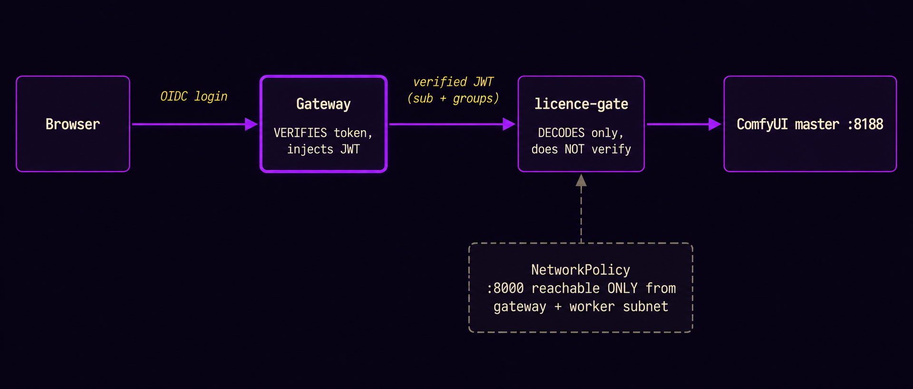

This is the structure of the **built** image-generation system. The full project architecture spans more (LLM routing, family-data, voice, a portal) but none of that is built — this page is deliberately narrowed to what a reproducer actually stands up.

## Three tiers

1. **Remote GPU workers** — the family's Windows PCs, GPUs *outside* the cluster. Each runs ComfyUI + the ComfyUI-Distributed plugin inside WSL2, exposes `:8188` on the LAN, sleeps by default, and is woken on demand.
2. **The always-on cluster** — a small Kubernetes cluster running the *control* side: a CPU-only ComfyUI **master** (orchestrator), the **licence-gate** proxy (the security boundary), and a **model-serve** sidecar. No GPUs here.
3. **Ingress** — the only door: a gateway doing OIDC auth (verifying identity, injecting a JWT) in front of the licence-gate.

Solid arrows are the request/render path; dotted are model pulls. **The master never renders** — it validates the graph and dispatches to a worker over ComfyUI-Distributed; the worker renders and returns the result, which the master saves to per-user storage.

## The render data-flow (what happens on "generate")

## The auth chain (the one invariant — do not vary)

The gateway **verifies**; the licence-gate **trusts and only decodes**. That is safe **only** because a NetworkPolicy makes the licence-gate unreachable except via the gateway. Expose `:8000` directly and anyone can forge the JWT → full identity/role spoof. The OIDC provider **must emit a groups claim** or role/maturity gating silently no-ops. (Full detail in `06-licence-gate-security-model.md`; capability framing in `03`.)

## Key decisions & trade-offs (the interesting engineering story)

| Decision | Why | Pay | Gain |
|---|---|---|---|
| **GPUs are NOT cluster nodes** — Windows PCs as plain LAN workers | A kubelet expects an always-up node; the sleep/wake (WoL) lifecycle + WSL2 GPU passthrough under kubelet is fragile | A bespoke power model outside Kubernetes | Sleep-by-default actually works; the cluster just sees "healthy backend or not" |
| **Orchestrator-only master + dumb workers** | One identity-aware policy point in front; workers stay replaceable | A hop through the master per render | Single place for licence + isolation + allowlist; workers are interchangeable render nodes |
| **Per-user isolation in a proxy, not in ComfyUI** | ComfyUI has no multi-tenancy; available auth plugins are full login systems that don't trust an upstream JWT | A bespoke Go proxy | One identity-aware policy point that *does* trust the gateway's verified JWT |
| **Licence gate by construction** | "Brand asset on a non-commercial model" must be impossible, not discouraged | Some jobs get rejected/substituted | Provable licence-cleanliness |
| **Tier-aware dispatch; jobs stay on one card** | 16/8 GB VRAM ceiling; cross-machine VRAM pooling doesn't pay off on a home LAN | No giant-model heroics | SDXL never lands on an 8 GB card → no OOM; predictable routing |
| **Role-gating by model TAG, not by workflow** | A per-workflow allowlist is craftable-around; tagging the model is not | Models must be tagged in the registry | Maturity boundaries hold even against hand-crafted requests |
| **Identity hardening over generic WAF** | The real threat is a compromised *authenticated* account, which a WAF doesn't address | MFA/SSO setup friction | Defends the threat that matters |

## Component responsibilities (one line each)

- **Gateway + OIDC provider** — authenticate; inject a verified JWT carrying `sub` + `groups`. The only door.
- **licence-gate** (the crown jewel, `06`) — decode identity; default-deny node allowlist; licence + role + tier gating; per-user output isolation (write-rewrite + read-scope + canonical 404s).
- **ComfyUI master** (`05`) — CPU-only; validate the graph; dispatch to a worker via ComfyUI-Distributed; save the collected result to the user's bucket. No GPU, no auth plugin.
- **model-serve** (`05`,`08`) — token-auth read-only file server over the models volume; server-side `ingest` to pull + hash-verify models.
- **GPU workers** (`04`) — render. ComfyUI + Distributed in WSL2; the symmetric custom-node set; local model copies; firewalled to cluster sources.
- **RWX storage** — `models` (served), `output` (per-user buckets), `workflows`.
